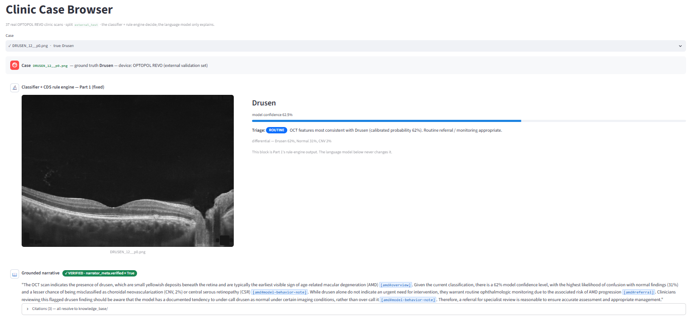

# OCT-Based Retinal Disease Classification and AI Clinical Decision Support

Research and educational project. **Not a medical device.** Every clinical
decision support recommendation is intended for review by a qualified clinician.

## 1. The Problem

Optical Coherence Tomography (OCT) provides detailed cross-sectional images of the
retina and is central to diagnosing conditions like macular degeneration, diabetic
retinopathy and diabetic macular edema. However, interpreting OCT scans requires
clinical expertise, and large volumes of images can be time-consuming to review
manually.

To investigate this, I trained a convolutional neural network on the Retinal
OCT-C8 dataset, then tested the trained model on 37 de-identified real clinical
B-scans acquired with an OPTOPOL REVO OCT scanner. These clinic scans were held
out from training and model selection and used only as an independent external
validation set.

## 2. Dataset

Retinal OCT-C8 (Kaggle, `obulisainaren/retinal-oct-c8`) served as the training,
validation and test data. It is the authors' original pre-split: 3,000 images per
class, 24,000 images total (18,400 / 2,800 / 2,800), covering eight retinal
conditions:

- **AMD** — Age-related Macular Degeneration
- **CNV** — Choroidal Neovascularization
- **CSR** — Central Serous Retinopathy
- **DME** — Diabetic Macular Edema
- **DR** — Diabetic Retinopathy
- **Drusen**
- **Macular Hole**
- **Normal**

(Class ids are frozen in [`data/metadata/label_map.json`](data/metadata/label_map.json).)

The 37 OPTOPOL REVO clinic scans (27 unique patients, some with both eyes imaged)
cover only 4 of these 8 classes (Drusen: 22, Normal: 9, DME: 5, CNV: 1),
reflecting the natural case mix of a small real clinic sample rather than a
curated benchmark. They are de-identified patient data and are not included in
this repository (`data/` is git-ignored).

## 3. Pre-processing

Images were standardized through a deterministic pipeline: ROI crop, resize,
grayscale-to-RGB conversion and ImageNet normalization, applied identically
across every split so no split-specific inconsistency could bias results. Data
augmentation was applied only during training, to reduce overfitting without
altering the validation or test distributions.

## 4. Model

The classifier is a DenseNet-121, initialized with ImageNet-pretrained weights and
fine-tuned on OCT-C8. Transfer learning was chosen deliberately: starting from
general visual features and adapting them to OCT-specific structure is both more
data-efficient and faster to train than learning from scratch on 18,400 images.

```
OCT image → DenseNet-121 (ImageNet-pretrained) → learned features → classification head → 8-class probabilities
```

Training used the Adam optimizer with weight decay, cross-entropy loss, a
head-warmup phase (first 3 epochs train only the new classification head; the
backbone unfreezes afterward), learning-rate scheduling, early stopping
(patience 7 on validation macro-F1) and best-checkpoint selection.

## 5. Results

The best model (epoch 17 by validation macro-F1) was evaluated on OCT-C8's
held-out test set of 2,800 images, with temperature scaling fit on validation
data to calibrate output probabilities.

| Metric | Value |
|---|---|
| Accuracy | 96.46% |
| Macro-F1 | 96.46% |
| Expected Calibration Error (post-calibration) | 0.64% |

Four classes (AMD, CSR, DR, Macular Hole) achieved perfect scores across every
metric. The harder classes (CNV, DME, Drusen) still scored strongly (F1 90–93%),
reflecting genuine visual overlap between these conditions on OCT. Full per-class
figures are written to `<output_dir>/eval/metrics_test.json` and
`confusion_test.csv`.

This result was reproduced on a separate day from a freshly retrained model with
the same random seed. Every metric, including per-class figures, matched to the
decimal, confirming the training pipeline is fully deterministic.

## 6. External Clinical Validation

The trained model was then evaluated on the 37 real clinical OCT scans acquired
with the OPTOPOL REVO scanner.

| Dataset | Accuracy |
|---|---|
| OCT-C8 held-out test set | 96.46% |
| OPTOPOL REVO clinical scans | 59.46% |

The approximately 37-percentage-point reduction in accuracy was one of the most
important findings.

I investigated why the performance changed so substantially. The likely cause is
domain shift: the public OCT-C8 images and the clinical scans were acquired under
different imaging conditions, and differences in scanner characteristics,
contrast, noise and acquisition protocol can change the visual distribution
presented to the model even when the underlying anatomy is identical.

A model can perform extremely well on a held-out test set while still failing to
generalize to a different clinical domain. This became a central finding of this
experiment.

## 7. Explainability with Grad-CAM

To investigate the model's predictions rather than looking only at accuracy, I
used Grad-CAM (Gradient-weighted Class Activation Mapping), which visualizes the
image regions that contributed most strongly to a prediction. This was applied to
the clinical errors specifically (the misclassified Drusen cases), to distinguish
between two possible failure modes:

1. The model is looking at the wrong part of the image.
2. The model is looking at the relevant retinal region but interpreting it
   incorrectly.

In the cases examined, the model's attention was consistently concentrated around
the correct retinal region of interest, even when the final classification was
wrong. This suggests the failures were not caused by the model attending to
irrelevant background: it could identify the relevant anatomical region but still
assign the wrong disease label. This is an important distinction, because visual
attention alone is not sufficient to guarantee a clinically reliable prediction.


*Two misclassified clinical Drusen scans. Each strip is `[ raw B-scan | Grad-CAM
for the predicted (wrong) class ]`; the heatmap for the wrong label still sits on
the drusen region. Source overlays and selection notes:
[docs/figures/README.md](docs/figures/README.md).*

## 8. Clinical Decision Support Safety Layer

A rule-based Clinical Decision Support (CDS) layer was added to translate model
predictions and calibrated confidence into a triage recommendation (routine, soon,
urgent, or defer to specialist), with the goal of testing whether a
confidence-based safety mechanism can prevent uncertain predictions from becoming
unsafe recommendations.

The results revealed an important limitation. Among the 14 misclassified Drusen
clinical cases, several predictions carried high enough softmax confidence that
the CDS layer did not flag them as uncertain:

- **7 of the 14 misclassified Drusen cases were confidently triaged as "no
  referral."**

The same pattern appears in-distribution and worsens under domain shift. For each
misclassification, the table shows whether CDS deferred it to a specialist (the
safe outcome) or asserted a confident wrong triage:

| Split | Misclassifications | Confident wrong triage | Deferred to specialist |
|---|---|---|---|
| Test (OCT-C8) | 99 | 63 | 36 |
| External — Drusen only | 14 | 10 (7 → `none`) | 4 |

Even on the in-distribution test set, MSP-based confidence lets roughly two
thirds of errors through as confident triage calls; on the domain-shifted clinic
Drusen scans it is worse still.

This is more concerning than a simple classification error, because the model was
not merely wrong: it was wrong with enough apparent confidence to influence the
downstream decision-support output. The underlying issue is not a poorly tuned
confidence threshold; it is that maximum softmax probability (MSP) reflects the
model's certainty relative to its own learned decision boundary, not whether the
input resembles anything it was trained on. A domain-shifted image can push the
model confidently toward the wrong class precisely because MSP has no mechanism
for recognizing "this doesn't look like my training data"; it only measures
relative certainty among the classes it already knows.

### Part 2 — retrieval-augmented narrative layer

A follow-on layer adds a clinician-facing narrative explanation on top of the
Part 1 recommendation, generated by a local language model (Qwen2.5-3B) grounded
in a small curated knowledge base (National Eye Institute and CC-BY sources only;
AAO Preferred Practice Patterns are excluded on licensing grounds). The language
model never makes or influences the diagnostic or urgency decision: the
impression and triage are copied verbatim from Part 1's rule engine, and an
automated check discards any narrative that cites a passage it was not given,
asserts a different class, or softens the fixed triage.

On the 37-scan clinic set: 16 cases skipped as predicted-normal and 6 as
model-abstained; of the 15 remaining, **15/15 (100%) produced a verified,
fully-cited narrative** (12 first-shot, 3 after one citation retry), with zero
fallbacks and zero unresolved citations.



*[`app/case_browser.py`](app/case_browser.py) — a chat-style Streamlit viewer
over the 37 pre-computed narratives (no model, no GPU). Each case shows the OCT
scan, Part 1's fixed decision, and the routed narrative (grounded / skipped /
fell back) with a Verified indicator from `narrator_meta`. Run it locally with
`streamlit run app/case_browser.py`, or on Kaggle via a cloudflared tunnel — see
[app/README.md](app/README.md).*

Full write-up: **[PART2.md](PART2.md)**. Walkthrough notebook:
[`notebooks/demo_part2.ipynb`](notebooks/demo_part2.ipynb).

## 9. Limitations

- **Small external clinical sample.** The clinical validation set contains only 37
  scans (27 unique patients) and cannot be treated as a representative clinical
  dataset.
- **Class imbalance.** The clinical scans are heavily concentrated in Drusen and
  Normal cases, with only one CNV scan. Class-specific clinical performance should
  be interpreted cautiously, and CNV results are not statistically meaningful at
  n = 1.
- **Domain shift.** The large gap between OCT-C8 and OPTOPOL performance
  demonstrates that scanner and acquisition differences can significantly affect
  model generalization.
- **Confidence is not the same as reliability.** The CDS experiment showed that
  maximum softmax probability can remain high even when the model is incorrect
  under domain shift.
- **No feature-space OOD detector yet.** A concrete next step is feature-space
  out-of-distribution detection (e.g. Mahalanobis distance), so unfamiliar
  clinical images can be flagged before a confident-but-wrong prediction becomes a
  CDS recommendation.

Full detail, including per-class external caveats and the Grad-CAM review, is in
[LIMITATIONS.md](LIMITATIONS.md).

---

The practical guide to running the code.

## Layout

```
configs/            Hydra configs (paths/ data/ model/ training/ preprocess/ cds/ rag/)
data/metadata/      label_map.json + data dictionary (only tracked data files)
knowledge_base/     Part 2 RAG corpus — 6 curated entries (NEI + CC-BY) + SOURCES.md
src/oct_cds/
  data/             manifests, OPTOPOL filename parser, Dataset + DataModule, QC
  preprocessing/    deterministic transforms + train-only augmentation
  models/           timm backbones, LightningModule, losses, temp scaling, ckpt loading
  evaluation/       metrics (sens/spec, AUROC/AUPRC, QWK, ECE), confusion, bootstrap CIs
  explainability/   Grad-CAM runner + heatmap overlays
  cds/              schema, rule engine, OOD gate, guideline refs, report, audit, batch summary
  rag/              Part 2 — ingest, embed, FAISS index, decision-aware retrieval,
                    LLM backends, prompt, narrator, verify.py guardrail, cache
train.py  eval.py  explain.py  cds.py    Hydra entrypoints (train → eval → explain → CDS)
rag_narrate.py                           Part 2 entrypoint (grounded narrative layer)
app/case_browser.py         Streamlit viewer for the pre-computed clinic narratives
notebooks/demo.ipynb        Part 1 end-to-end walkthrough
notebooks/demo_part2.ipynb  Part 2 walkthrough (knowledge base, a narrated case, verify stats)
tests/
```

## Quickstart

```bash
pip install -e ".[dev,explain]"
```

Pick an environment via the `paths` config group — `configs/paths/<env>.yaml`
holds the dataset + output locations for that machine:

| env | file | OCT-C8 / clinic roots | outputs |
|---|---|---|---|
| `default` | `paths/default.yaml` | Colab + Google Drive | `/content/drive/MyDrive/oct_cds_outputs` |
| `kaggle` | `paths/kaggle.yaml` | `/kaggle/input/...` (read-only) | `/kaggle/working/oct_cds_outputs` |

```bash
# 1. build manifests (writes data/processed/*.csv). --paths selects the env;
#    --set overrides any single path.
python -m oct_cds.cli data build --paths kaggle
#    or:  python -m oct_cds.cli data build --set paths.oct_c8_raw_root=/some/path
```

```bash
# 2. train (DenseNet-121 primary; swap backbone / env from the CLI)
python train.py paths=kaggle
python train.py paths=kaggle model=resnet50
python train.py model=efficientnet_b3 training.max_epochs=40   # default env
```

> **Resume:** `checkpoints/last.ckpt` is written every epoch under
> `paths.outputs_root`. Re-running the **same command** after a crash/disconnect
> **auto-resumes** from it (`training.auto_resume=false` to disable,
> `training.resume_from=<path>` to pick one). On Kaggle, `/kaggle/working` persists
> with the notebook version; on Colab, outputs default to Google Drive.
>
> **Colab:** `training.num_workers` defaults to 2 (~2 vCPUs). For speed, copy
> OCT-C8 off the Drive FUSE mount to `/content/oct_c8` first and pass
> `paths.oct_c8_raw_root=/content/oct_c8`. `train.py` hard-exits when run as
> `!python train.py` so the cell doesn't hang on lingering DataLoader workers.

```bash
# 3. evaluate on the held-out test set (auto-picks the best checkpoint under
#    <output_dir>/checkpoints, refits temperature scaling on val)
python eval.py paths=kaggle
python eval.py paths=kaggle eval.split=external_test          # the 37 OPTOPOL scans
python eval.py paths=kaggle eval.ckpt_path=/path/to/some.ckpt eval.calibration=load
```
> Writes `<output_dir>/eval/metrics_<split>.json` + `confusion_<split>.csv` and
> prints accuracy, macro/weighted/balanced F1, per-class sensitivity / specificity
> / precision / F1 / AUROC / AUPRC, macro AUROC/AUPRC, quadratic-weighted kappa,
> the confusion matrix, and ECE **before and after** temperature scaling.

```bash
# 4. Grad-CAM overlays  (needs the explain extra: pip install -e '.[explain]')
python explain.py paths=kaggle                                   # test set, <=200 overlays
python explain.py paths=kaggle explain.split=external_test       # the 37 clinic scans
python explain.py paths=kaggle explain.split=external_test \
    'explain.classes=[Drusen]' explain.only_errors=true explain.target=both
```
> Overlays: `<output_dir>/explain/<split>/<correct|wrong>/<true_class>/<stem>__pred-<x>_p<conf>__cam-<pred|true>-<class>.png`
> (each is `[ raw scan | heatmap overlay ]` on the model's 224px view). Plus
> `index.csv` mapping every overlay to true / predicted / probability. So the
> misclassified Drusen scans land in `.../explain/external_test/wrong/Drusen/`.
> `explain.target=both` saves a heatmap for the predicted class *and* the true
> class side by side — for checking whether the model attended to the same region
> for both (it usually did — see the Results section).

```bash
# 5. CDS layer — run calibrated predictions through the rules/urgency/abstention
python cds.py paths=kaggle                          # OCT-C8 test set
python cds.py paths=kaggle cds_run.split=external_test   # the 37 clinic scans
python cds.py paths=kaggle cds_run.split=external_test cds_run.write_reports_for=all
python -m oct_cds.cli cds demo                      # single synthetic case
```
> Writes to `<output_dir>/cds/`: `recommendations_<split>.csv` (per-image: probs,
> ood score, abstained / ood_rejected, urgency, recommendation text),
> `summary_<split>.json`, `reports/<split>/<stem>.{txt,json}` (full narratives for
> `write_reports_for`), and `audit_<split>.jsonl`. The summary's headline number:
> **on the images the model got wrong, how many did CDS defer to a specialist
> (good) vs assert a confident wrong urgency (bad)** — broken down by true class,
> so you can read off exactly how the misclassified Drusen cases were triaged.
> Tune thresholds on the CLI: `cds.min_confidence=0.75 cds.min_margin=0.20`.

```bash
# 6. Part 2 — grounded narrative layer  (pip install -e '.[rag]')
python rag_narrate.py paths=kaggle rag.llm.backend=stub          # offline sanity check
python rag_narrate.py paths=kaggle rag_run.split=external_test   # local Qwen2.5-3B
```
> Runs Part 1's CDS recommendation, then a local LLM writes a cited narrative
> grounded in `knowledge_base/`. `verify.py` discards any narrative that cites an
> unretrieved passage, asserts a different class, or softens the fixed triage —
> on failure the report keeps Part 1's templated text. Writes
> `<output_dir>/rag/narratives_<split>.jsonl`, `summary_<split>.json`, and
> `rejected_<split>.txt`. The LLM never touches the decision. See
> **[PART2.md](PART2.md)**.

```bash
pytest
```

### Experiment notebook

[`notebooks/demo.ipynb`](notebooks/demo.ipynb) walks the finished pipeline —
manifest summary, model architecture, test metrics + confusion matrix, external
validation, Grad-CAM examples, CDS summary — by loading the artifacts the
entrypoints above produce (no duplicated logic). Run the numbered steps first so
the artifacts exist, then:

```bash
pip install -e ".[notebook,explain]"
OCT_CDS_ENV=kaggle jupyter lab notebooks/demo.ipynb          # interactive; Run All

# or render a shareable HTML (run from the repo root):
OCT_CDS_ENV=kaggle jupyter nbconvert --to html --execute notebooks/demo.ipynb --output-dir docs/
```

It picks up `configs/paths/$OCT_CDS_ENV.yaml` (`kaggle` or `default`); each cell
prints the command to run if its artifact is missing.

[`notebooks/demo_part2.ipynb`](notebooks/demo_part2.ipynb) does the same for
Part 2 — the knowledge base, one narrated case with its citation-grounded
narrative, and the verification summary (`pip install -e ".[notebook,rag]"`).

### Case browser app

[`app/case_browser.py`](app/case_browser.py) is a chat-style Streamlit app for
browsing all 37 pre-computed clinic narratives — the OCT scan, Part 1's frozen
decision, and the grounded narrative (or the "skipped / fell back" notice), with
a Verified indicator from `narrator_meta`. No model, no GPU. See
[app/README.md](app/README.md) for the local and Kaggle (cloudflared tunnel) run
recipes.

## Reproducing this project

**1. Get OCT-C8.** Download from Kaggle:
<https://www.kaggle.com/datasets/obulisainaren/retinal-oct-c8>. You need the
directory that contains `train/`, `val/`, `test/` (each with the 8 class folders
`AMD CNV CSR DME DR DRUSEN MH NORMAL`).

**2. The 37 clinic scans are not in this repo.** They are private, de-identified
patient data (OPTOPOL REVO, single center) and are not redistributable. Every
`external_test` / clinic step is optional — skip it and the internal-test
pipeline runs end to end. The filename convention the parser expects is
`{LABEL}[_{patient}]__{eye}.png` (`eye` ∈ `L`,`R`,`p0`); point
`paths.clinic_optopol_raw_root` at a folder of such files to run external
validation on your own data.

**3. Pick the environment config.**

| Where you run | Command suffix | Edit for your paths |
|---|---|---|
| Kaggle | `paths=kaggle` | `configs/paths/kaggle.yaml` |
| Colab + Google Drive | `paths=default` | `configs/paths/default.yaml` |
| Anywhere | `--set paths.oct_c8_raw_root=/abs/path` (CLI) / `paths.oct_c8_raw_root=/abs/path` (Hydra) | — |

Then run the numbered steps above: `data build` → `train` → `eval` → `explain` →
`cds`.

**4. The trained checkpoint is not committed** (too large for git). Training the
DenseNet-121 from scratch takes roughly 45 min–1.5 h on a single modern GPU and
reproduces the reported numbers exactly (seed `1337`, `Trainer(deterministic=True)`;
verified — a full retrain on a later date reproduced every test-set metric,
including per-class, to the decimal). To skip retraining, download the exact
`epoch 17` checkpoint
(`val/macro_f1 = 0.9236`) and its `temperature.json` from Google Drive:
<https://drive.google.com/drive/folders/1cS7Ov0uZ9UO3BmqBX8oMVVeQzKBOvIuN?usp=sharing>
and place them under `<output_dir>/checkpoints/` and `<output_dir>/calibrators/`
respectively (`eval.py` / `explain.py` / `cds.py` auto-pick the checkpoint from
there).

## Pipeline stages

1. **Ingest & QC** — checksum, de-identification review, quality flags (`src/oct_cds/data/`)
2. **Manifests** — CSV per split; patient-level leakage checks; OPTOPOL locked to `external_test`
3. **Preprocess** — ROI crop → resize → grayscale→RGB → ImageNet normalize (identical for every split)
4. **Train** — timm backbone, head-warmup then unfreeze, weighted/focal loss option, cosine LR
5. **Calibrate** — temperature scaling on val; CDS consumes calibrated probs only
6. **Evaluate** — internal test + OPTOPOL external set; per-class sens/spec, AUROC/AUPRC, QWK, ECE, bootstrap CIs
7. **Explain** — Grad-CAM overlays
8. **CDS** — OOD gate → confidence/margin abstention → rule-based urgency → report + audit log
