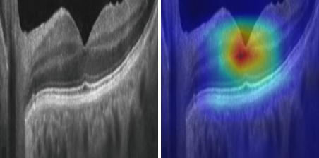
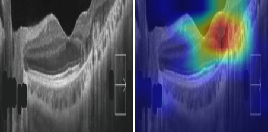

# OCT-Based Retinal Disease Classification and AI Clinical Decision Support

8-class retinal OCT B-scan classifier (**Retinal OCT-C8**) with a deterministic
clinical-decision-support layer that turns calibrated model probabilities into a
triage recommendation and a human-readable report.

> Research / decision-support tooling. **Not a diagnostic device.** Every
> recommendation is for review by a qualified clinician.

## Classes

`AMD` · `CNV` · `CSR` · `DME` · `DR` · `Drusen` · `Macular Hole` · `Normal`
(frozen ids in [`data/metadata/label_map.json`](data/metadata/label_map.json))

## Data

| Dataset | Role | Notes |
|---|---|---|
| Retinal OCT-C8 (Kaggle `obulisainaren/retinal-oct-c8`) | train / val / test | Authors' pre-split, 3,000/class → 18,400 / 2,800 / 2,800. **Not re-split.** |
| OPTOPOL REVO clinic B-scans (`data/external/clinic_optopol/`, 37 images) | external validation only | Different vendor. Never trained on, never used for model selection. |

`data/` is git-ignored — patient scans never leave this machine.

## Results

**DenseNet-121** (ImageNet-pretrained, 224 px), best epoch 17 (val macro-F1
0.9236), temperature-scaled on val.

### Held-out test set — OCT-C8, 2,800 images

| Metric | Value |
|---|---|
| Accuracy | **96.46%** |
| Macro-F1 | **96.46%** |
| Expected Calibration Error (after temperature scaling) | **0.64%** |

Per-class sensitivity / specificity / precision / F1 / AUROC / AUPRC and the
confusion matrix: `<output_dir>/eval/metrics_test.json`, `confusion_test.csv`.

### External validation — OPTOPOL REVO clinic scans, 37 images

| Metric | Value |
|---|---|
| Accuracy | **59.46%** |

A ~37-point drop from the internal test set. The clinic scans come from a
different device family (OPTOPOL REVO) than OCT-C8's source scanners, so this is
a **domain-shift** finding, not a model-quality one. Only 4 of 8 classes appear
in the clinic set (Drusen 22, Normal 9, DME 5, CNV 1). See
[LIMITATIONS.md](LIMITATIONS.md).

### CDS safety gap under domain shift

The CDS layer should *abstain* ("refer to specialist") when the model is unsure
rather than assert a wrong triage. It does on genuinely low-confidence cases —
but **MSP-based confidence does not reliably flag confident-but-wrong
predictions**, the dominant failure mode under domain shift:

| Split | Misclassifications | Confident wrong triage | Deferred to specialist |
|---|---|---|---|
| Test (OCT-C8) | 99 | 63 | 36 |
| External — Drusen only | 14 | 10 (7 triaged **`none`** / "no referral") | 4 |

Seven misclassified clinic Drusen scans were confidently triaged as needing **no
referral** — the worst direction for a screening aid. Proposed fix (Mahalanobis
feature-space OOD detection) is a TODO — see [LIMITATIONS.md](LIMITATIONS.md).

### Grad-CAM — misclassified clinic Drusen




Each strip is `[ raw B-scan | Grad-CAM for the predicted (wrong) class ]` on the
model's 224 px input view.

**Finding: correct localisation, wrong classification.** Even when the model
calls these scans `Normal`/`CSR`, its Grad-CAM for that wrong class still sits on
the drusen region — and across the 4 misclassification pairs reviewed with
`explain.target=both`, 3 of 4 had the predicted- and true-class heatmaps in
nearly the **same** place (only `DRUSEN_9__L` → DME diverged). 8 of 14
misclassified Drusen scans were called `Normal`. So the error is *semantic, not
spatial*: the model attends to the pathology but misreads what it is. A
saliency-overlap or "is it looking at the retina?" check would not flag this —
reinforcing the case for feature-space OOD detection in the CDS layer
([LIMITATIONS.md](LIMITATIONS.md)).

Source overlays and the selection rationale:
[docs/figures/README.md](docs/figures/README.md). Regenerate with `python
explain.py paths=<env> explain.split=external_test 'explain.classes=[Drusen]'
explain.only_errors=true explain.target=both`.

## Layout

```
configs/            Hydra configs (paths/ data/ model/ training/ preprocess/ cds/)
data/metadata/      label_map.json + data dictionary (only tracked data files)
src/oct_cds/
  data/             manifests, OPTOPOL filename parser, Dataset + DataModule, QC
  preprocessing/    deterministic transforms + train-only augmentation
  models/           timm backbones, LightningModule, losses, temp scaling, ckpt loading
  evaluation/       metrics (sens/spec, AUROC/AUPRC, QWK, ECE), confusion, bootstrap CIs
  explainability/   Grad-CAM runner + heatmap overlays
  cds/              schema, rule engine, OOD gate, guideline refs, report, audit, batch summary
train.py  eval.py  explain.py  cds.py    Hydra entrypoints (train → eval → explain → CDS)
notebooks/demo.ipynb   end-to-end walkthrough of the finished pipeline
tests/
```

## Quickstart

```bash
pip install -e ".[dev,explain]"
```

Pick an environment via the `paths` config group — `configs/paths/<env>.yaml`
holds the dataset + output locations for that machine:

| env | file | OCT-C8 / clinic roots | outputs |
|---|---|---|---|
| `default` | `paths/default.yaml` | Colab + Google Drive | `/content/drive/MyDrive/oct_cds_outputs` |
| `kaggle` | `paths/kaggle.yaml` | `/kaggle/input/...` (read-only) | `/kaggle/working/oct_cds_outputs` |

```bash
# 1. build manifests (writes data/processed/*.csv). --paths selects the env;
#    --set overrides any single path.
python -m oct_cds.cli data build --paths kaggle
#    or:  python -m oct_cds.cli data build --set paths.oct_c8_raw_root=/some/path
```

```bash
# 2. train (DenseNet-121 primary; swap backbone / env from the CLI)
python train.py paths=kaggle
python train.py paths=kaggle model=resnet50
python train.py model=efficientnet_b3 training.max_epochs=40   # default env
```

> **Resume:** `checkpoints/last.ckpt` is written every epoch under
> `paths.outputs_root`. Re-running the **same command** after a crash/disconnect
> **auto-resumes** from it (`training.auto_resume=false` to disable,
> `training.resume_from=<path>` to pick one). On Kaggle, `/kaggle/working` persists
> with the notebook version; on Colab, outputs default to Google Drive.
>
> **Colab:** `training.num_workers` defaults to 2 (~2 vCPUs). For speed, copy
> OCT-C8 off the Drive FUSE mount to `/content/oct_c8` first and pass
> `paths.oct_c8_raw_root=/content/oct_c8`. `train.py` hard-exits when run as
> `!python train.py` so the cell doesn't hang on lingering DataLoader workers.

```bash
# 3. evaluate on the held-out test set (auto-picks the best checkpoint under
#    <output_dir>/checkpoints, refits temperature scaling on val)
python eval.py paths=kaggle
python eval.py paths=kaggle eval.split=external_test          # the 37 OPTOPOL scans
python eval.py paths=kaggle eval.ckpt_path=/path/to/some.ckpt eval.calibration=load
```
> Writes `<output_dir>/eval/metrics_<split>.json` + `confusion_<split>.csv` and
> prints accuracy, macro/weighted/balanced F1, per-class sensitivity / specificity
> / precision / F1 / AUROC / AUPRC, macro AUROC/AUPRC, quadratic-weighted kappa,
> the confusion matrix, and ECE **before and after** temperature scaling.

```bash
# 4. Grad-CAM overlays  (needs the explain extra: pip install -e '.[explain]')
python explain.py paths=kaggle                                   # test set, <=200 overlays
python explain.py paths=kaggle explain.split=external_test       # the 37 clinic scans
python explain.py paths=kaggle explain.split=external_test \
    'explain.classes=[Drusen]' explain.only_errors=true explain.target=both
```
> Overlays: `<output_dir>/explain/<split>/<correct|wrong>/<true_class>/<stem>__pred-<x>_p<conf>__cam-<pred|true>-<class>.png`
> (each is `[ raw scan | heatmap overlay ]` on the model's 224px view). Plus
> `index.csv` mapping every overlay to true / predicted / probability. So the
> misclassified Drusen scans land in `.../explain/external_test/wrong/Drusen/`.
> `explain.target=both` saves a heatmap for the predicted class *and* the true
> class side by side — for checking whether the model attended to the same region
> for both (it usually did — see the Results section).

```bash
# 5. CDS layer — run calibrated predictions through the rules/urgency/abstention
python cds.py paths=kaggle                          # OCT-C8 test set
python cds.py paths=kaggle cds_run.split=external_test   # the 37 clinic scans
python cds.py paths=kaggle cds_run.split=external_test cds_run.write_reports_for=all
python -m oct_cds.cli cds demo                      # single synthetic case
```
> Writes to `<output_dir>/cds/`: `recommendations_<split>.csv` (per-image: probs,
> ood score, abstained / ood_rejected, urgency, recommendation text),
> `summary_<split>.json`, `reports/<split>/<stem>.{txt,json}` (full narratives for
> `write_reports_for`), and `audit_<split>.jsonl`. The summary's headline number:
> **on the images the model got wrong, how many did CDS defer to a specialist
> (good) vs assert a confident wrong urgency (bad)** — broken down by true class,
> so you can read off exactly how the misclassified Drusen cases were triaged.
> Tune thresholds on the CLI: `cds.min_confidence=0.75 cds.min_margin=0.20`.

```bash
pytest
```

### Demo notebook

[`notebooks/demo.ipynb`](notebooks/demo.ipynb) walks the finished pipeline —
manifest summary, model architecture, test metrics + confusion matrix, external
validation, Grad-CAM examples, CDS summary — by loading the artifacts the
entrypoints above produce (no duplicated logic). Run the numbered steps first so
the artifacts exist, then:

```bash
pip install -e ".[notebook,explain]"
OCT_CDS_ENV=kaggle jupyter lab notebooks/demo.ipynb          # interactive; Run All

# or render a shareable HTML (run from the repo root):
OCT_CDS_ENV=kaggle jupyter nbconvert --to html --execute notebooks/demo.ipynb --output-dir docs/
```

It picks up `configs/paths/$OCT_CDS_ENV.yaml` (`kaggle` or `default`); each cell
prints the command to run if its artifact is missing.

## Reproducing this project

**1. Get OCT-C8.** Download from Kaggle:
<https://www.kaggle.com/datasets/obulisainaren/retinal-oct-c8>. You need the
directory that contains `train/`, `val/`, `test/` (each with the 8 class folders
`AMD CNV CSR DME DR DRUSEN MH NORMAL`).

**2. The 37 clinic scans are not in this repo.** They are private, de-identified
patient data (OPTOPOL REVO, single center) and are not redistributable. Every
`external_test` / clinic step is optional — skip it and the internal-test
pipeline runs end to end. The filename convention the parser expects is
`{LABEL}[_{patient}]__{eye}.png` (`eye` ∈ `L`,`R`,`p0`); point
`paths.clinic_optopol_raw_root` at a folder of such files to run external
validation on your own data.

**3. Pick the environment config.**

| Where you run | Command suffix | Edit for your paths |
|---|---|---|
| Kaggle | `paths=kaggle` | `configs/paths/kaggle.yaml` |
| Colab + Google Drive | `paths=default` | `configs/paths/default.yaml` |
| Anywhere | `--set paths.oct_c8_raw_root=/abs/path` (CLI) / `paths.oct_c8_raw_root=/abs/path` (Hydra) | — |

Then run the numbered steps above: `data build` → `train` → `eval` → `explain` →
`cds`.

**4. The trained checkpoint is not committed** (too large for git). Training the
DenseNet-121 from scratch takes roughly 45 min–1.5 h on a single modern GPU and
reproduces the reported numbers exactly (seed `1337`, `Trainer(deterministic=True)`;
verified — a full retrain on a later date reproduced every test-set metric,
including per-class, to the decimal). To skip retraining, download the exact
`epoch 17` checkpoint
(`val/macro_f1 = 0.9236`) and its `temperature.json` from Google Drive:
<https://drive.google.com/drive/folders/1cS7Ov0uZ9UO3BmqBX8oMVVeQzKBOvIuN?usp=sharing>
and place them under `<output_dir>/checkpoints/` and `<output_dir>/calibrators/`
respectively (`eval.py` / `explain.py` / `cds.py` auto-pick the checkpoint from
there).

## Limitations

The external-validation and CDS findings have important caveats — small
single-device external set, 4 of 8 classes never externally validated, CNV
n = 1, the domain-shift result, and the MSP-confidence gap in the CDS layer.
**Read [LIMITATIONS.md](LIMITATIONS.md) before citing any result.**

## Pipeline stages

1. **Ingest & QC** — checksum, de-identification review, quality flags (`src/oct_cds/data/`)
2. **Manifests** — CSV per split; patient-level leakage checks; OPTOPOL locked to `external_test`
3. **Preprocess** — ROI crop → resize → grayscale→RGB → ImageNet normalize (identical for every split)
4. **Train** — timm backbone, head-warmup then unfreeze, weighted/focal loss option, cosine LR
5. **Calibrate** — temperature scaling on val; CDS consumes calibrated probs only
6. **Evaluate** — internal test + OPTOPOL external set; per-class sens/spec, AUROC/AUPRC, QWK, ECE, bootstrap CIs
7. **Explain** — Grad-CAM overlays
8. **CDS** — OOD gate → confidence/margin abstention → rule-based urgency → report + audit log
